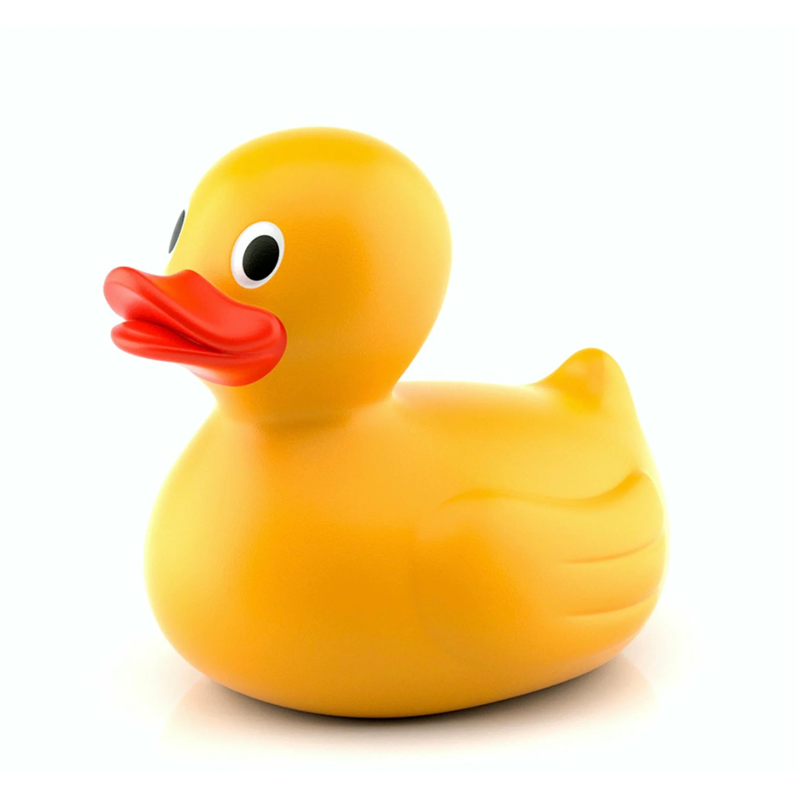
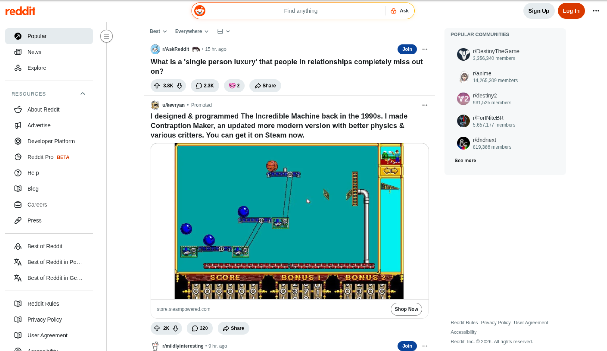

---
layout: module_title
---
# Module Title Here

::number::

#1

---
layout: topic_title
---
# Topic Title Here

::number::

#1.1

---
layout: contents
topic: '1.1'
---

---
layout: unit_title
unit: '1.1.2'
---
# Unit Title Here

---
layout: content_plain
---

# Plain content slide

- This is some plain text content.
  - This is a first-level bullet point.
    - Sub-bullets are supported.
      - And they can go as deep as you like.
- The unit number on the side is inherited from the previous unit title slide.

::annotations::

Annotations can optionally be added to slides — *yep*.

---
layout: content_plain
---

# Three-Column Slide

<ThreeColumns>

<div>

## First Column

- Bla bla.
- Bla.
- Bla bla bla.

</div>

<div>

## Second Column

- Yadi.
- Yada. Yadi yadi yada.
- Yada yada.

</div>

<div>

## Third Column

- Yet more stuff.
- And things.
- And more things.

</div>

</ThreeColumns>

---
layout: content_plain
---

# Imperative vs Declarative

<TwoColumns>

<div>

## First column

- This is some connt in the first column, i.e. the column on the left. 
- It can be used to compare two things, e.g. two paradigms, two approaches, etc.

</div>

<div>

## Second column

- We can also insert images via markdown:
{.w-60 .mr-auto}
- or via HTML:

- Use `mx-auto` to center images horizontally, and `mr-auto` to align them to the left.

</div>

</TwoColumns>

::annotations::

Using columns with images

---
layout: content_plain
---

# Slide with code

- This slide has some code. Default markdown code format is supported:

```python
def greet(name):
    return f"Hello, {name}!"

print(greet("World"))
```

- You can also use `code-lg`, `code-md` and `code-sm` for larger or smaller code blocks:

<TwoColumns>

<div>

- Using `code-md`

```python  {class:'code-md'}
def greet(name):
    return f"Hello, {name}!"
```

</div>

<div>

- Using `code-sm`

```python  {class:'code-sm'}
def greet(name):
    return f"Hello, {name}!"
```

</div>

</TwoColumns>

::annotations::

Annotations can optionally be added to slides — *yep*.

---
layout: content_plain
---

# Choose Your Framework

- Comparisons can be added by inserting a `<Comparisons>` component, which creates a grid layout for comparing multiple options side by side.

<Comparisons>

<div>

## Option 1

The text goes here

</div>

<div>

## Option 2

The text goes here

</div>

<div>

## Option 3

The text goes here

</div>

<div>

## Option 4

The text goes here

</div>

</Comparisons>

---
layout: project_title
---
# A Project Slide

::description::

Use this slide to introduce a project, assignment, or case study. The description section can be used to provide an overview of the project, its objectives, and any relevant details.


---
layout: content_with_image
---

# Slide with image

- This slide has an image on the right side, which can be added via markdown or HTML.

::image::


---
layout: content_with_code
---

# Slide wih code

- This slide contains code on the right hand side.

::code::

```tsx
import { useState } from 'react'

function Counter() {
  const [count, setCount] = useState(0)

  return (
    <button onClick={() => setCount(count + 1)}>
      Clicked {count} times
    </button>
  )
}
```

::annotations::

`useState` is the foundational React hook for component state.

---
layout: content_phone
---

# Mobile Layout

- This slide allows you to preview the look and feel of your content on a mobile device. The screen image is auto-framed by `<DeviceFrame>` — varous presets are available.

|Preset|Resolution|Devices|
|-|-|-|
|`iphone-6.9`|1320x2868|iPhone Air, 17/16 Pro Max|
|`iphone-6.9-alt`|1290x2796|iPhone 16 Plus, 15 Pro Max|
|`iphone-6.3`|1206x2622|iPhone 17 Pro, 17|
|`iphone-6.3-alt`|1179x2556|iPhone 16 Pro, 16, 15 Pro|
|`iphone-6.1`|1170x2532|iPhone 14, 13, 12|
|`iphone-5.5`|1242 x 2208|iPhone 8 Plus, 7 Plus|
|`android-phone`|1080 x 1920|Standard Android (16:9)|
|`android-phone-tall`|1080 x 2400|Modern Android (20:9)|

::screen::

<DeviceFrame src="./phone.png" device="iphone-6.3" />

---
layout: content_tablet
---

# Tablet Layout

- Use `content_tablet` to preview your content on an iPad. Pass `orientation="landscape"` for landscape mockups.

|Preset|Resolution|Devices|
|-|-|-|
|`ipad-13`|2064x2752|iPad Pro M5/M4|
|`ipad-13-alt`|2048x2732|iPad Pro 12.9" (6th–1st gen)|
|`ipad-11`|1668x2388|iPad Pro 11", iPad Air|
|`ipad-11-alt`|1640x2360|iPad (10th gen), iPad Air (M2)|
|`android-tablet-10`|1600x2560|10" Android tablet|

::screen::

<DeviceFrame src="./tablet.png" device="ipad-13-alt" orientation="landscape" />

---
layout: content_desktop
---

# Desktop Layout

- This slide allows you to preview the look and feel of your content on a desktop screen.

::screen::


---
layout: student_area
url: 'https://my.icecampus.com'
---

::screen::

<DeviceFrame src="./student_area.png" device="ipad-13-alt" orientation="landscape" />

---
layout: educator
---

# Your Educator

- **📚 The Basics** 
  - 47th president of the United States of America.
- **👤 Role** 
  - Commander-in-Chief, master tweeter, deal-maker-in-chief.
- **🏆 Qualifications** 
  - Self-described very stable genius. 
  - Multiple bankruptcies, two impeachments.
- **😊 Hobbies & Other Stuff** 
  - Golf, executive orders, late-night posts.

- `object-position` adjusts the position of the photo.
  - First number: left/right (`0%` = pin left, `100%` = pin right).
  - Second number: up/down (`0%` = pin top, `100%` = pin bottom).

::photo1::


::photo2::


---
layout: statement
---

This is a statment

---
layout: statement_alt
---

This is also a statement

---
layout: big_fact
---

# 99%

Of statistics are made up on the spot.

---
layout: big_fact_alt
---

# 1 in 3
People are statistically significant.

---
layout: big_quote
---

# "This is a quote"

::attribution::

Keith Vassallo

---
layout: big_quote_alt
---

# "I like big butts and I cannot lie"

::attribution::

Sir Mix-a-Lot, *Baby Got Back*

---
layout: showcase
---

# Showcase

::main::


::top::


::bottom::


---
layout: content_plain
---

# Character Styles

- Click the [Settings]{.ui} button to open the preferences panel.
- Use [npm install]{.code} to install dependencies.
- The [Submit]{.ui} button sends the form to [/api/users]{.code}.
- Wrap [terminology]{.em} in emphasis for emphasised inline text.
- Run on <Logo name="mac" /> macOS, <Logo name="windows" /> Windows, or <Logo name="linux" /> Linux.

::annotations::

- Three inline character styles: [.em] for emphasis, [.ui] for UI element names, [.code] for inline code.
- Inline logos via `<Logo name="mac|windows|linux" />`.

---
layout: content_plain
---

# Animating through code

- You can choose which parts of a code block to show (test by moving right):

```python {all|2-3,6|12}
# src/main.py
class SampleClass:
  def __init__(self):
    self.attribute = "default value"

  def exampleMethod(self):
    print("This is an example method.")

  def anotherMethod(self, param):
    return f"Received parameter: {param}"

  @property
  def computedProperty(self):
    return f"Computed value based on {self.attribute}"
```

- You can specify a single line or a range, such as `{2-3, 6}`. 
- You can add a `|` for the next transition, such as `{all|2-3,6|12}` to show all lines first, then highlight lines 2-3 and 6, and finally line 12.

---
layout: content_plain
---

# Slide with video

- You can embed YouTube videos:

<iframe width="560" height="315" src="https://www.youtube.com/embed/dQw4w9WgXcQ?si=fVQIEZBXWHZU6K0N" title="YouTube video player" frameborder="0" allow="accelerometer; autoplay; clipboard-write; encrypted-media; gyroscope; picture-in-picture; web-share" referrerpolicy="strict-origin-when-cross-origin" allowfullscreen></iframe>

- Or local videos:

<video controls class="w-100">
  <source src="./sample.mp4" type="video/mp4">
  Your browser does not support the video tag.
</video>

---
layout: closing_slide
startYear: 2025
---